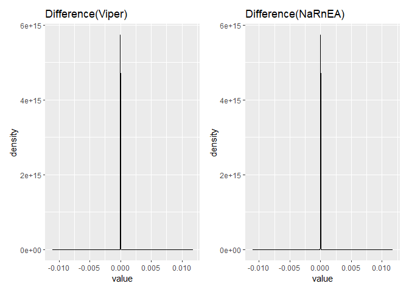

Bench_R\_vs_Py
================
2024-01-21

### Import library and datasets

### Run narnea

``` r

net.list = list(pruned_Ductal_1,pruned_Ductal_2)
ducal_2 = meta_narnea(Ductal_2_signature_1000, net.list, sample.weights = TRUE)
## WARNING: Running `meta_narnea` with sample.weights = TRUE may be very slow for large number of samples.
## Data prep...Calculating DES...Calculating UES...Calculating NES...Calculating PES...Done
## Data prep...Calculating DES...Calculating UES...Calculating NES...Calculating PES...Done
## 载入需要的程辑包：abind
## Constructing weight matrix...
## Performing integration...
op_nes = ducal_2$NES
```

### Run viper

``` r

duplicate_Removal_conversion<-function(ARACNe3_regulon){

  elements_to_remove<-names(ARACNe3_regulon)[which(duplicated(names(ARACNe3_regulon))==TRUE)]

  ARACNe3_regulon_NoDuplicates<-ARACNe3_regulon

  ARACNe3_regulon_NoDuplicates[elements_to_remove]<-NULL

  ARACNe3_regulon_NoDuplicates_converted<-list()

  for (i in 1:length(ARACNe3_regulon_NoDuplicates)){

    tfmode<-ARACNe3_regulon_NoDuplicates[[i]]$am

    likelihood<-unname(ARACNe3_regulon_NoDuplicates[[i]]$aw)

    tmp_list<-list(tfmode, likelihood)

    names(tmp_list)<-c("tfmode", "likelihood")

    ARACNe3_regulon_NoDuplicates_converted[[i]]<-tmp_list

    names(ARACNe3_regulon_NoDuplicates_converted)[i]<-names(ARACNe3_regulon_NoDuplicates)[i]

  }

  class(ARACNe3_regulon_NoDuplicates_converted)<-"regulon"

  return(ARACNe3_regulon_NoDuplicates_converted)

}

net.list = lapply(net.list, duplicate_Removal_conversion)
ducal_2_viper = viper(Ductal_2_signature_1000, net.list, method = 'none', minsize = 30,verbose = FALSE)
```

### Compare the results

``` r
op_nes_py = read_csv('pyviper_narnea_nes.csv') 
## New names:
## Rows: 1000 Columns: 6622
## ── Column specification
## ──────────────────────────────────────────────────────── Delimiter: "," chr
## (1): ...1 dbl (6621): AAMP, AATF, ABCA1, ABCA12, ABCA3, ABCA7, ABCA8, ABCB1,
## ABCB11, A...
## ℹ Use `spec()` to retrieve the full column specification for this data. ℹ
## Specify the column types or set `show_col_types = FALSE` to quiet this message.
## • `` -> `...1`
indexes =  op_nes_py %>% pull(...1)

op_nes_py = op_nes_py %>%
  select(-...1)
rownames(op_nes_py) = indexes
op_nes_py = t(op_nes_py)

op_nes = op_nes[,colnames(op_nes_py)]
op_nes = op_nes[rownames(op_nes_py),]
```

``` r
op_nes_py_area = read_csv('pyviper_area_nes.csv') 
## New names:
## Rows: 1000 Columns: 6622
## ── Column specification
## ──────────────────────────────────────────────────────── Delimiter: "," chr
## (1): ...1 dbl (6621): AAMP, AATF, ABCA1, ABCA12, ABCA3, ABCA7, ABCA8, ABCB1,
## ABCB11, A...
## ℹ Use `spec()` to retrieve the full column specification for this data. ℹ
## Specify the column types or set `show_col_types = FALSE` to quiet this message.
## • `` -> `...1`
indexes =  op_nes_py_area %>% pull(...1)
op_nes_py_area = op_nes_py_area %>%
  select(-...1)
rownames(op_nes_py_area) = indexes
op_nes_py_area = t(op_nes_py_area)

ducal_2_viper = ducal_2_viper[,colnames(op_nes_py_area)]
ducal_2_viper = ducal_2_viper[rownames(op_nes_py_area),]
```

### pyviper area VS R viper

``` r

print('correlation')
## [1] "correlation"
cor(as.vector(ducal_2_viper), as.vector(op_nes_py_area))
## [1] 1
print('Average absolute difference')
## [1] "Average absolute difference"
mean(abs(as.vector(ducal_2_viper)-as.vector(op_nes_py_area)))
## [1] 8.690822e-07
print('Average associate difference')
## [1] "Average associate difference"
mean(abs(as.vector(ducal_2_viper)-as.vector(op_nes_py_area))/abs(as.vector(ducal_2_viper)))
## [1] 3.864748e-06

dens_a =  data.frame(value = as.vector(ducal_2_viper)-as.vector(op_nes_py_area))
a = dens_a %>% ggplot(aes(x = value)) +
  geom_density() + 
  labs(title = "Difference(Viper)")
```

### pyviper narnea VS R narnea

``` r
print('correlation')
## [1] "correlation"
cor(as.vector(op_nes), as.vector(op_nes_py))
## [1] 0.9999999
print('Average absolute difference')
## [1] "Average absolute difference"
mean(abs(as.vector(op_nes)-as.vector(op_nes_py)))
## [1] 2.653232e-06
print('Average associate difference')
## [1] "Average associate difference"
mean(abs(as.vector(op_nes)-as.vector(op_nes_py))/abs(as.vector(op_nes)))
## [1] 1.92264e-05

dens_b =  data.frame(value = as.vector(op_nes)-as.vector(op_nes_py))
b = dens_a %>% ggplot(aes(x = value)) +
  geom_density() + 
  labs(title = "Difference(NaRnEA)")
```

### visualization

``` r
a + b
```

<!-- -->
